# Awesome-AI-Search-Insight-Engine

# Awesome-AI-Search-Insight-Engine 🔍 💡

  

  
  
  
  
  
  

---

## 🌟 Top AI Search & Insight Engine Ecosystem

**Curated List of Commercial Search & Insight Platforms & Open-Source Semantic Retrieval Systems**  
*Focused on Hybrid Search, RAG with Citations, Faceted Navigation, Agentic Search, Knowledge Graphs & Self-Hosted Insight Engines*

**Last updated: October 2026** 📅

---

### 📌 Overview & SEO Summary
Welcome to the ultimate curated directory of **AI search and insight engines**, **open-source semantic retrieval systems**, and **RAG-powered knowledge discovery platforms**. Whether you are looking for enterprise-grade commercial solutions (such as *Glean*, *Coveo*, and *Sinequa*), or self-hostable open-source alternatives (like *Turing*, *Onyx*, and *Meilisearch*), this list covers category leaders, hybrid search, and privacy-respecting insight engine infrastructure.

**Key Market Context:**
- **Glean** is the **most advanced AI search and insight engine**, with **100+ connectors**, **knowledge graph**, and **agentic workflows** — used by **Databricks, Reddit, and Duolingo** .
- **Turing (Viglet)** is the **most complete open-source insight engine**, providing **faceted semantic search, hybrid BM25+vector ranking, RAG chat with citations, AI agents, and MCP tools** on Apache Solr, Elasticsearch, or embedded Lucene — **Apache-2.0 licensed with no per-query, per-record, or per-seat metering** .
- **Onyx** is the **leading open-source AI platform for enterprise**, with **agentic RAG, deep research, web search, and 50+ connectors**, supporting **all major LLM providers** including self-hosted options .
- **Meilisearch** is the **fastest-growing open-source search engine**, with **hybrid search, conversational search, and sub-50ms latency**, and **works out of the box with LangChain and MCP** .

---

## 📑 Table of Contents
- [🏢 SaaS & Commercial Platforms](#-saas--commercial-platforms)
- [🔓 Open-Source GitHub Projects](#-open-source-github-projects)
- [🛠️ How to Contribute](#%EF%B8%8F-how-to-contribute)
- [📊 Star History](#-star-history)
- [🤝 Support & Sponsorship](#-support--sponsorship)
- [⚠️ Disclaimer](#%EF%B8%8F-disclaimer)

---

## 🏢 SaaS / Commercial Platforms

The AI search and insight engine market spans **AI-native search platforms** (Glean, Hebbia) that were **built from the ground up for semantic retrieval and RAG**, **enterprise search suites** (Coveo, Sinequa, Lucidworks) that provide **unified search across enterprise data with connectors and governance**, and **search-as-a-service APIs** (Algolia NeuralSearch, Elastic Enterprise Search) that offer **developer-friendly search infrastructure**. **Glean** uses **custom enterprise pricing** starting around **$50K/year for 100 users** . **Coveo** uses **custom enterprise pricing** based on **annual search volume** . **Algolia NeuralSearch** starts at **$1/month** for the Build plan with **10,000 search requests** . **Amazon Kendra** charges **$1.125/hour for Enterprise Edition** plus **$0.25 per 1,000 queries** . **Yext Search** uses **custom enterprise pricing** with **listings-based pricing** .

| SaaS / Commercial Platform | Company / Owner | Valuation / Market Cap | Standard Edition Starting Price | Free Tier / Free Trial Limits | Description |
| :--- | :--- | :--- | :--- | :--- | :--- |
| **[Glean](https://www.glean.com/)** 🎯 | Glean | ~$4.6 Billion | **Custom enterprise pricing** (from ~$50K/year for 100 users) | **No free tier**; demo available | **Enterprise search and AI assistant** — **100+ connectors** for enterprise data . **Knowledge graph with permissions-aware search** . **Glean Assistant, Chat, and Agents** . **Used by Databricks, Reddit, Duolingo, and Canvas** . |
| **[Coveo Relevance Cloud](https://www.coveo.com/)** 🟢 | Coveo | ~$1 Billion | **Custom enterprise pricing** (annual search volume) | **Free trial available** | **AI-powered relevance platform** — **Unified search across enterprise data** . **ML-driven relevance and personalization** . **The most relevance-focused enterprise search platform** . |
| **[Sinequa](https://www.sinequa.com/)** 🔷 | Sinequa | Private | **Custom enterprise pricing** | **Demo available** | **Enterprise search and analytics** — **Unified search across 200+ data sources** . **Natural language processing and ML** . **The most scalable enterprise search platform** . |
| **[Lucidworks Fusion](https://lucidworks.com/)** 🟣 | Lucidworks | Private | **Custom enterprise pricing** | **Free trial available** | **AI-powered search platform** — **Built on Apache Solr** . **Hybrid search with vector and keyword retrieval** . **The most customizable enterprise search platform** . |
| **[Algolia NeuralSearch](https://www.algolia.com/)** ⚡ | Algolia | ~$2.25 Billion | **$1/month** (Build, 10K search requests) | **Free: 10K search requests/month** | **Developer-first search API with neural hashing** — **Sub-50ms search latency** . **Vector search and AI-powered relevance** . **The most developer-friendly search platform** . |
| **[Elastic Enterprise Search](https://www.elastic.co/enterprise-search)** 🔵 | Elastic N.V. | ~$10 Billion | **$95/month** (Standard, 1 deployment) | **Free: 14-day trial** | **Enterprise search on Elasticsearch** — **Workplace Search, App Search, and Site Search** . **Built on the Elastic Stack** . **Vector search and RAG pipelines** . |
| **[Amazon Kendra](https://aws.amazon.com/kendra/)** ☁️ | Amazon | ~$2.0 Trillion | **$1.125/hour** (Enterprise Edition) + **$0.25/1,000 queries** | **Free tier: 750 hours for 30 days** | **AWS-native intelligent search** — **ML-powered search across enterprise data** . **40+ connectors** for S3, SharePoint, Salesforce, and more . **Natural language queries with precise answers** . |
| **[Hebbia](https://www.hebbia.com/)** 🧠 | Hebbia | Private | **Custom enterprise pricing** | **Demo available** | **AI research and analysis platform** — **Matrix** for document-heavy workflows in finance, legal, and media . **Multi-document analysis and synthesis** . |
| **[Salesforce Insight Engine](https://www.salesforce.com/)** ☁️ | Salesforce | ~$250 Billion | **Included with Salesforce licenses** | **Free with Salesforce subscription** | **CRM-native insight engine** — **Personalized search results based on user behavior** . **Natural language search** . **Deep integration with Salesforce data** . |
| **[Yext Search](https://www.yext.com/)** 🟡 | Yext | ~$500 Million | **Custom enterprise pricing** | **Free trial available** | **AI search platform for brand websites** — **Answers with structured data** . **Listings management and knowledge graph** . |

---

## 🔓 Open-Source GitHub Projects

*Sorted by GitHub_Stars_Count (Descending)* 🌟

- **[Onyx](https://github.com/onyx-dot-app/onyx-foss)**   
  **The leading open-source AI platform for enterprise search**, MIT licensed. **The application layer for LLMs** — **agentic RAG, deep research, custom agents, web search, code execution, and 50+ connectors** . **Supports all major LLM providers** including self-hosted (Ollama, LiteLLM, vLLM) and proprietary (OpenAI, Anthropic, Gemini) . **Enterprise features**: SSO via Google OAuth, OIDC, or SAML; group syncing and user provisioning via SCIM; RBAC for sensitive resources; analytics; query history; and custom code execution . **The most complete open-source enterprise AI search platform** . 🔍

- **[Turing (Viglet)](https://github.com/openviglet/turing-ce)**   
  **Open-source enterprise search + generative AI platform**, Apache-2.0 licensed. **Faceted semantic search, hybrid BM25+vector ranking, RAG chat with citations, AI agents and MCP tools** — on Apache Solr, Elasticsearch, or embedded Lucene . **Indexes Adobe AEM, WordPress, databases and files via Viglet Dumont connectors** . **Self-hosted alternative to Algolia and Coveo** with **no per-query, per-record or per-seat metering** . **Supports regulated/air-gapped deploys** . **The most feature-complete open-source enterprise search alternative** . 🎯

- **[Meilisearch](https://github.com/meilisearch/meilisearch)**   
  **Lightning-fast search engine**, MIT licensed. **Hybrid search combining semantic and full-text** for the most relevant results . **Search-as-you-type in less than 50 milliseconds** . **Typo tolerance, filtering, faceted search, sorting, synonyms, geosearch, and extensive language support** . **Security management with API keys and multi-tenancy** . **Conversational search** lets users ask questions in natural language and get AI-generated answers grounded in search results . **Works out of the box with LangChain and MCP** . **The most developer-friendly open-source search engine** . ⚡

- **[Qdrant](https://github.com/qdrant/qdrant)**   
  **High-performance vector database and search engine**, Apache-2.0 licensed. **Written in Rust for speed and reliability under high load** . **Tailored for extended filtering support** — useful for semantic matching, faceted search, and recommendations . **Hybrid search with sparse vectors** for keyword-aware retrieval . **Vector quantization reduces RAM usage by up to 97%** . **Distributed deployment with sharding and replication** . **The most performant open-source vector database** . 🦀

- **[Weaviate](https://github.com/weaviate/weaviate)**   
  **Open-source vector database**, BSD-3-Clause licensed. **Built for mission-critical applications** with native support for **horizontal scaling, multi-tenancy, replication, and fine-grained RBAC** . **Vector compression and multi-vector encoding reduce memory usage** . **Object TTL for automatic data expiration** . **Comprehensive demo projects** including **Elysia (agentic system), Verba (RAG app), and Healthsearch** . **The most production-ready open-source vector database** . 🧠

- **[Elasticsearch](https://github.com/elastic/elasticsearch)**   
  **Distributed search and analytics engine**, Elastic License 2.0 / SSPL. **70K+ GitHub stars** — **the most widely deployed open-source search engine** . **Full-text search, vector search, and hybrid retrieval** . **Kibana for visualization** . **The foundation of Elastic Enterprise Search and thousands of applications** . 🔍

- **[OpenSearch](https://github.com/opensearch-project/OpenSearch)**   
  **Community-driven search and analytics suite**, Apache-2.0 licensed. **Fully open-source under the Linux Foundation** — **provides lexical search, log analytics, and a vector database for semantic search and generative AI workloads** . **OpenSearch Dashboards for visualization and monitoring** . **Data Prepper for ingestion and processing** . **The most permissively licensed enterprise search engine** . 🏛️

- **[RAGFlow](https://github.com/infiniflow/ragflow)**   
  **Open-source RAG engine based on deep document understanding**, Apache-2.0 licensed. **40K+ GitHub stars** — **template-based chunking and grounded citations** . **Built-in connectors for Jira, S3-compatible storage, and more** . **The most accurate open-source RAG engine** . 📄

- **[Open WebUI](https://github.com/open-webui/open-webui)**   
  **Extensible, self-hosted interface for AI that adapts to your workflow**, MIT licensed. **124K+ GitHub stars** — **document RAG, web RAG, tools, functions, and filters** . **Model management, prompt library, persistent chat history** . **Supports Ollama, OpenAI-compatible APIs, and 45+ knowledge base sources via oikb** . 🔒

- **[Apache Superset](https://github.com/apache/superset)**   
  **Modern data exploration and visualization platform**, Apache-2.0 licensed. **Rich set of data visualizations, no-code chart builder, and SQL editor** with support for most SQL-speaking databases . **Comprehensive REST API** for programmatic access to dashboards, charts, datasets, and databases . **The default open-source answer for Tableau-class dashboarding and data search** . 📊

- **[Enterprise DocSearch RAG](https://github.com/maitraria15-dot/enterprise-docsearch-rag)**   
  **Autonomous enterprise document search and QA agent**, open-source. **Built with LangGraph, Gemini 2.5 Flash, and FAISS Vector Search** . **The most accessible open-source enterprise document search agent** . 🤖

---

## 🛠️ How to Contribute

Contributions are welcome! Follow these steps to submit new AI search and insight engine platforms or open-source semantic retrieval software:

1. 🍴 **Fork** the repository.
2. 📝 **Add/edit** entries in `README.md` maintaining table/list structure and formatting.
3. 🔗 Include project title, official website/GitHub link, exact Stars_Count, license, and brief description.
4. 🚀 Submit a **Pull Request** with a descriptive summary of your changes.

---

## 📊 Star History

---

## 🤝 Support & Sponsorship

If you find this AI search and insight engine repository useful, please consider supporting the project:

- ⭐ **Star** this repository to increase visibility!
- 🔀 **Fork** and share with fellow search engineers, knowledge managers, and open-source advocates.
- ☕ **Sponsor & Buy Me a Coffee**: Support ongoing open-source curation via the [GitHub Sponsor Dashboard](https://github.com/sponsors/ishandutta2007).

---

## ⚠️ Disclaimer

- This is a **community-curated** list — not exhaustive and not an endorsement. ℹ️
- **Turing (Viglet) provides the most complete open-source enterprise search alternative to Algolia and Coveo** — **Apache-2.0 licensed with no per-query, per-record or per-seat metering** . **Onyx is the leading open-source AI platform for enterprise** with **agentic RAG, deep research, and 50+ connectors** . **Meilisearch offers the fastest search-as-you-type experience** with **sub-50ms latency** .
- **Open-source search and insight engines are not turnkey** — **Onyx requires Docker and LLM provider configuration** . **Turing requires Java 21+ and Maven** . **Qdrant and Weaviate require vector database deployment and indexing pipeline setup** . **Always validate search relevance, latency, and security with a proof-of-concept** before production deployment. 🔍

---

  <b>Made with ❤️ for search engineers, knowledge managers, and open-source insight engine advocates.</b>

